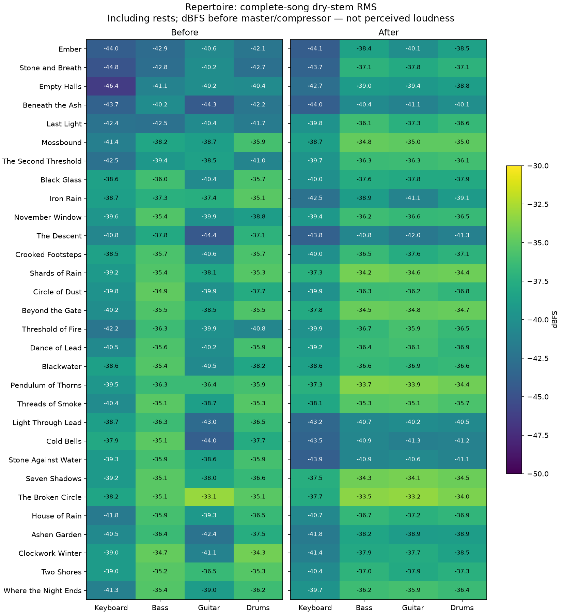

# Repertoire: Mischung nach Instrument und Rolle

2026-09-22. Ausgangspunkt: Bandarrangements aus `66f9a1c` mit der bereits kalibrierten FluidR3-Auswahl. Die reine Preset-Kalibrierung reichte nach der Neuinstrumentierung nicht aus.

## Befund und Korrektur

„Dance of Lead“, B-Teil: Keyboard −36,16 dBFS, Powerchord-Gitarre −44,24 dBFS. Abstand: −36,16 − (−44,24) = 8,08 dB. Nach der Korrektur: −36,73 und −40,14 dBFS; Abstand 3,41 dB. Das sind über den gesamten Abschnitt gemittelte trockene Stereo-RMS-Pegel einschließlich Pausen, vor dem Master. Die Gitarre gewinnt 4,10 dB; das führende Keyboard bleibt vorne.

Jedes Stück erhält eigene MIDI-CC7-Werte für Keyboard, Bass, Gitarre und Drums. Gitarren-Lead, Riff und Begleitung werden getrennt behandelt; beim Keyboard Lead und Begleitung. „Iron Rain“ berücksichtigt außerdem jeden Wechsel zwischen Muted Guitar und Distortion Guitar. Gleiche Rollen behalten innerhalb eines Stücks denselben Wert. Keine Normalisierung einzelner Noten oder Takte. Velocity, Akzente, Pausen und Notenlängen bleiben erhalten.

Die Mischung steht in den gemeinsamen MIDI-Dateien und gilt dadurch für Browser und MIDI Out. Der persönliche Übemix multipliziert diese Pegel; Mute und leise Führungsstimme bleiben unabhängig davon. Die Klangbalance fremder MIDI-Geräte kann von FluidR3 abweichen. Die SoundFont-Preset-Kalibrierung selbst wurde nicht erneut verändert.

## Messmethode

Alle 30 vollständigen Stücke mit sämtlichen 123 Abschnitten, plus drei Sekunden Ausklang je Stück. Musikalische Dauer pro Durchlauf: 2598,74 s / 60 = 43,31 min. Vorher und nachher bei 48 kHz gerendert, getrennte trockene Stereo-Instrumentenspuren und gemeinsamer Effektausgang. Keine Beschränkung auf die ersten A/B-Takte.

Melodische Stimmen: 80. Perzentil der RMS-Energie in 100-ms-Fenstern, die mindestens 40 ms MIDI-Notenaktivität enthalten; Gate 24 dB unter dem Gruppenmaximum. Drums: RMS über die gesamte Zeit einschließlich Pausen. Nur die kurzen Drum-Anschläge zu vergleichen würde ihren Pegel überschätzen und den resultierenden Mix zu leise machen. Intro und Schlussakkord bleiben bei der Ableitung der Rollenpegel außen vor, werden bei der vollständigen Kontrolle mitgemessen.

| Rolle | Relativer Messzielwert vor gemeinsamem Stück-Offset |
|---|---:|
| Gitarren-Lead | −28 dBFS |
| Gitarren-Riff / Keyboard-Lead / Bass | −29 dBFS |
| Gitarrenbegleitung / Drums | −31 dBFS |
| Keyboardbegleitung | −33 dBFS |

Diese Werte sind eine musikalische Mischentscheidung, kein Lautheitsstandard. Wegen der unterschiedlichen Messung der Drums sind sie keine Aussage über gleiche wahrgenommene Lautheit. Ein gemeinsamer Offset pro Stück hält alle CC7-Werte im Bereich 1–127. Umrechnung nach der Volume-Kennlinie: `CC7_neu = CC7_alt × 10^(ΔdB/40)`, anschließend runden. Unterschiedliche Anschlagsstärken bleiben hörbar.

Kontrolle mit einem zweiten vollständigen Render: alle Rollen innerhalb 1 dB ihrer Ziele. Größte Gesamtmix-Spitze einschließlich Effekten und Browser-Master 0,6: −11,32 dBFS, also 11,32 dB unter digitalem Vollpegel, vor dem Kompressor. Das ist ein Sample-Peak-Befund, keine True-Peak- oder LUFS-Messung. Die Messung ersetzt keinen subjektiven Hörvergleich.



[Messwerte aller Stücke und Abschnitte](repertoire-mix.json) · [MIDI-Mischwerte](../../scripts/repertoire-mix.json) · [SVG](repertoire-mix.svg)

## Reproduktion

```sh
node scripts/build-repertoire.mjs --unmixed
node scripts/analyze-repertoire-mix.mjs /tmp/repertoire-before.json
node scripts/calibrate-repertoire-mix.mjs /tmp/repertoire-before.json scripts/repertoire-mix.json
node scripts/build-repertoire.mjs
node scripts/analyze-repertoire-mix.mjs /tmp/repertoire-after.json
node scripts/report-repertoire-mix.mjs /tmp/repertoire-before.json /tmp/repertoire-after.json
python3 scripts/plot-repertoire-mix.py
npm test
npm run test:browser
```

Das Plot-Skript benötigt NumPy und Matplotlib. Die Analyse hält nur einen Renderblock im Speicher und schreibt Messfenster statt kompletter PCM-Dateien. Arrangement- und Bank-Prüfsummen verhindern, dass ein veralteter Abgleich unbemerkt auf geänderte Musik angewendet wird. Nach Änderungen an Noten, Dynamik, Instrumentierung oder SoundFont erneut kalibrieren und prüfen. `--unmixed` dient ausschließlich diesem Ablauf; vor Veröffentlichung den kalibrierten Build und die Tests ausführen.
