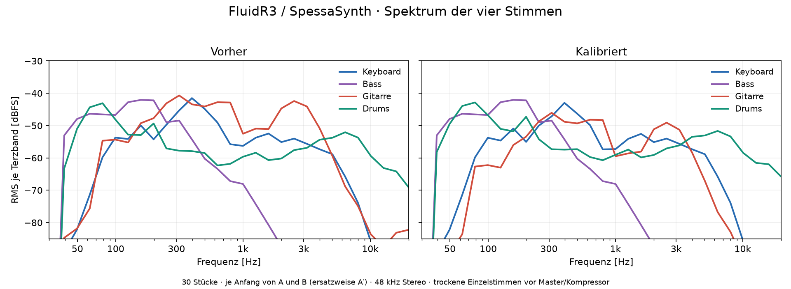

# SoundFont: Spektrum und Pegelbalance

2026-09-22. Vergleich gegen die unveränderte FluidR3-Auswahl aus Commit `75c833a`.



Die Diagramme dokumentieren die Arrangements vor der Überarbeitung der Gitarrenparts. Sie sind keine Messung der aktuellen Bandarrangements. Die Preset-Kalibrierung bleibt unverändert.

Der spätere [Abgleich sämtlicher Repertoire-Instrumente und Rollen](REPERTOIRE_MIX.md) ergänzt diese Preset-Korrektur mit MIDI-Lautstärken.

## Messung

30 Stücke, jeweils die ersten acht Sekunden von A und B; bei „Stone and Breath“ ersetzt A′ das nicht vorhandene B. 30 × 2 × 8 = 480 Sekunden Arrangementmaterial pro Variante. Originale MIDI-Programme, Controller und Anschlagsstärken. SpessaSynth Core 4.3.22 rendert bei 48 kHz getrennte Stereoausgänge für Keyboard, Bass, Gitarre und Drums sowie den gemeinsamen Effektausgang.

Spektren: Hann-Fenster mit 4096 Samples und 50 % Überlappung. Stereo-Leistung pro Terzband, danach gleich gewichtetes Leistungsmittel über die Stücke. Kurven zeigen trockene Einzelstimmen vor Master und Kompressor. Die Gesamtmix-Spitzen schließen den Effektausgang und den Browser-Masterfaktor 0,6 ein.

RMS misst Energie, keine subjektive Lautheit und keine LUFS. Transienten, Pausen, Register und Klangfarbe beeinflussen den Höreindruck zusätzlich. Die Ausschnitte decken nicht jeden Solo-, Schluss- und Zwischenabschnitt ab.

## Befund

- Mit Standard-Kit liegt die Gitarre im Median 11,4 dB über den Drums: pro Stück Gitarren-RMS minus Drum-RMS, Median der zehn Stücke mit Kit 0. Nach Kalibrierung: 0,4 dB.
- Im Präsenzbereich 2–8 kHz: Gitarrenenergie −38,5 dBFS, Drums −46,4 dBFS. Differenz: −38,5 − (−46,4) = 7,9 dB. Nachher: −45,4 und −45,8 dBFS, also 0,4 dB. Das ist ein Hinweis auf mögliche Verdeckung von Drum-Anschlägen durch die Gitarre; eine isolierte Kausalitätsmessung ist es nicht.
- Gegenbeispiel zum pauschalen „alle Drums sind zu leise“: In „Clockwork Winter“ liegt der ursprüngliche Drum-RMS rund 1 dB über der Gitarre. Das Power-Kit erhält deshalb keinen zusätzlichen Netto-Gain.
- Das E-Piano liegt in seinen Arrangements erheblich über dem akustischen Piano. Auch dieses Preset wird abgesenkt.

## Korrektur

| Preset, nullbasiert | Änderung | Umsetzung |
|---|---:|---|
| Clean Guitar 27 | −5 dB | Preset-Attenuation |
| Muted / Overdrive / Distortion Guitar 28–30 | −8 dB | Preset-Attenuation |
| Electric Piano 4 | −6 dB | Preset-Attenuation |
| Standard Drums 0 | +6 dB | Drum-Bus |
| Power Drums 16 | 0 dB netto | −6 dB Preset, +6 dB Bus |
| Piano 0, Bass 33 | 0 dB | Unverändert |

+6 dB entspricht `10^(6/20) ≈ 1,995` als Amplitudenfaktor, −5 dB etwa `0,562`, −8 dB etwa `0,398`. Keine Velocity-Anhebung: Anschlagscharakter und Dynamik bleiben erhalten. Kein zusätzlicher EQ. Patches werden individuell im SoundFont abgeglichen, MIDI-Programwechsel behalten diese Balance automatisch. Der Übemix multipliziert die kalibrierten Pegel.

Höchste gemessene Gesamtmix-Spitze: vorher −13,6 dBFS, nachher −15,0 dBFS, jeweils vor dem Browser-Kompressor. In diesen Ausschnitten entsteht durch die Drum-Anhebung kein Clipping. MIDI Out und die gemeinsamen MIDI-Dateien bleiben unverändert; fremde Klangerzeuger benötigen ihre eigene Balance.

## Reproduktion und Prüfungen

[Messwerte je Stück und Terzband](soundfont-levels.json) · [Vektorgrafik](soundfont-spectrum.svg) · [Kalibrierung](../../assets/soundfont/balance.json).

```sh
# Vorher-Datei aus dem dokumentierten Commit extrahieren.
git show 75c833a:assets/soundfont/FluidR3-a-minor.sf2 > /tmp/FluidR3-before.sf2
node scripts/analyze-soundfont.mjs /tmp/spectrum-before /tmp/FluidR3-before.sf2 none
node scripts/analyze-soundfont.mjs /tmp/spectrum-after
# Python benötigt numpy und matplotlib.
python3 scripts/plot-soundfont.py /tmp/spectrum-before /tmp/spectrum-after docs/audio
node --test tests/soundfont.test.cjs
npm run test:browser
```

Die Analyse schreibt temporäre PCM-Dateien; beide Durchläufe benötigen zusammen ungefähr 1,72 GiB (`480 s × 48000 Samples/s × 10 Kanäle × 4 Bytes × 2 Varianten / 1024³`). Die Rohdaten gehören nicht ins Repository.

Regressionsprüfung: gemessene Referenzpegel der früheren Bank für Piano, E-Piano, vier Gitarrenklänge, Bass sowie Kick/Snare beider Kits. Die neue Bank muss die vorgesehenen dB-Differenzen im tatsächlich gerenderten PCM innerhalb 0,05 dB treffen. Zusätzlich bleiben Hüllkurven-, Pitch-Bend-, Hi-Hat-, Ausklang-, Stop-, Lade- und Übemixprüfungen aktiv.
